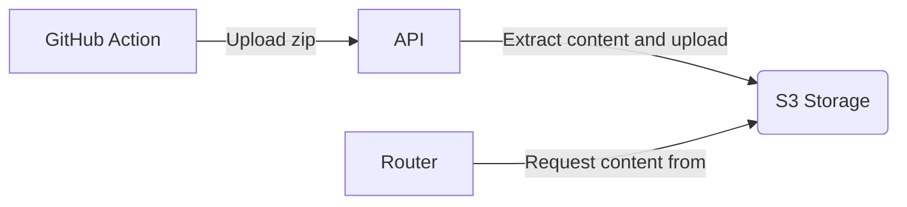

# StaticPages

## Components



## High Level Overview

* A GitHub Action Workflow builds my static web page
* The GitHub Action Workflow uploads the web page via the `/upload` API endpoint
* The StaticPages app now ingests the web page to the configured S3 storage in a sub-folder with commit-sha for example:

```plaintext
.
├── <HEAD>/
│   ├── extracted_zip_content...
│   └── index.html
├── <HEAD~1>/
│   ├── extracted_zip_content...
│   └── index.html
├── <HEAD~2>/
│   ├── extracted_zip_content...
│   └── index.html
└── <HEAD~3>/
    ├── extracted_zip_content...
    └── index.html
```

* If we call `/activate` the commit-sha `/activate` is called for will be stored and and the router component can pick up this SHA to proxy calls to the Domain to the commit-sha folder in our S3 bucket
* After `/activate` was completed, we can trigger the execution of a garbage collector to clean up older commit SHA folders to save storage space in S3

## API Endpoints

- `PUT /upload`
    - Upload a zip archive of the web-page
- `PUT /activate/{commit-sha}`
    - "Activate" a commit-sha 

## Config Structure

```yaml
spec:
  domain: specht-labs.de

  # Configure the S3 bucket where the website is hosted in
  bucket:
    url: <s3 bucket URI>
    application_id: ENV(‘APPLICATION_ID’) # use ENV() as an expression to indicate reading the value from env-vars
    secret: ENV(‘SECRET_NAME’)

  # specify a (default) retention period (how many commit websites to keep)
  history: 10

  # Grant access to repositories to use this domain
  allowed:
    # Option 1: allow an entire org
    - https://github.com/SpechtLabs/*

    # Option 2: fine graned control to individual repositories
    - https://github.com/SpechtLabs/spechtlabs.github.io

  # Configure how sub-domains are handed out
  # {{ .Environment }} - the environment as sent by GHA
  # {{ .RepoName }} - the name of the Git repository 
  # {{ .Domain }} - the Domain name configured at the top of the page
  sub-domains:
    'spechtlabs.github.io':
        # pattern supports go-template
        pattern: '{{ if len(.Environment) gt 0 }} {{ .Environment }}.{{ end }}{{ .Domain }}'
        history: 15                # keep the latest 15 commits (except the 'active' commit)

    '*':
        pattern: '{{ .RepoName }}.{{ .Domain }}'
```